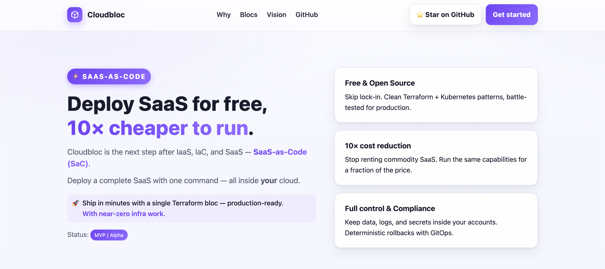
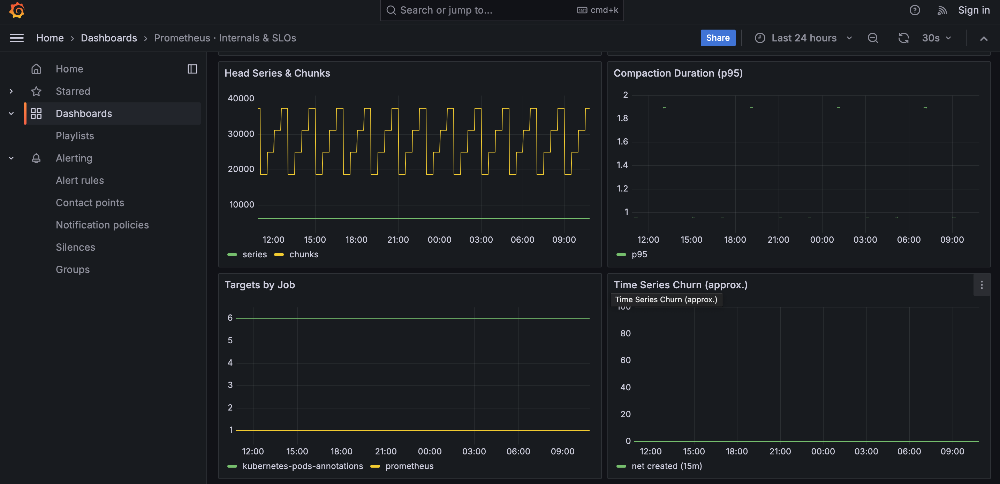
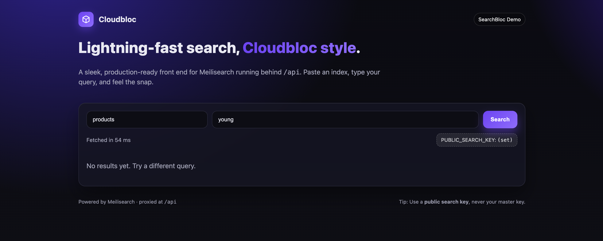
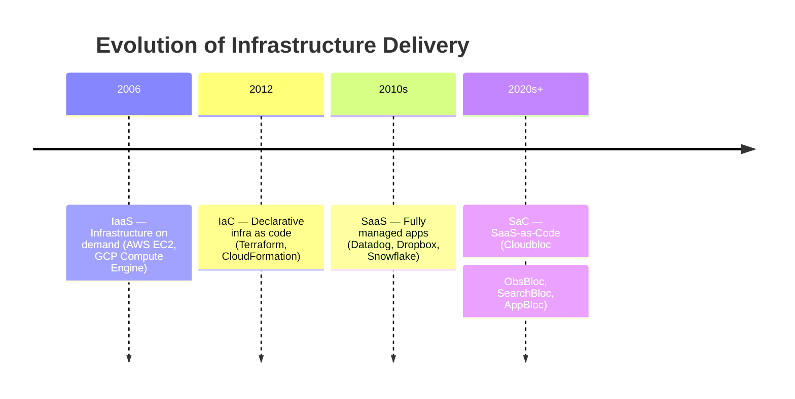

[](LICENSE)
[](.github/CONTRIBUTING.md)
[](https://github.com/googleapis/release-please)


# Cloudbloc — Cloud Building Blocks

## ⚡ SaaS-as-Code
**One Terraform module (bloc) = One SaaS replacement.**

👉 **SaaS-as-Code**: opinionated Terraform + Kubernetes modules that let you replace overpriced SaaS with **self-hosted building blocks on your Cloud.**

💡 With Cloudbloc, you don’t stitch together infra. You drop in **one module** and get a **core SaaS replacement** running in your cluster.
Just set a few variables → production-ready stack. No YAML sprawl. No manual plumbing.

> 🔓 **Everything in this repository is open source and will remain free forever.**

---

## 🌐 Live Demos

| Bloc          | Live URL                                              | Replacement        |
|---------------|-------------------------------------------------------|--------------------|
| 🚀 **AppBloc**   | [cloudbloc.io](https://cloudbloc.io)                     | Heroku Core             |
| 📊 **ObsBloc**   | [obsbloc.cloudbloc.io](https://obsbloc.cloudbloc.io)     | Datadog Core            |
| 🔍 **SearchBloc**| [searchbloc.cloudbloc.io](https://searchbloc.cloudbloc.io) | Elasticsearch/Algolia Core |

---
### 📸 Screenshots

**🚀 AppBloc**


**📊 ObsBloc**


**🔍 SearchBloc**


---

**Cloudbloc** is the next step after *IaaS, IaC, and SaaS.*

🔧 **How it works:**
Each bloc is a pre-packaged Terraform module that wires up the right cloud + Kubernetes resources for you. **Minimal infra work, maximum leverage.**

> 🔓 **Everything in this repository is open source and will remain free forever.**

---

### 💸 Why it matters

Most teams burn **\$50K–\$500K per year** on SaaS, and actually use **10–20% of the features.**
With today’s OSS ecosystem, you can cover the critical pieces for **10% of the cost** — if you have the right building blocks.

**Cloudbloc delivers those blocks.**
Deploy production-ready modules straight into your GCP cluster:

* **No YAML wrangling**
* **No SaaS lock-in**
* **No million-dollar bills**

---

### 🚀 Current status

> **MVP / Alpha** — These blocs are already running on real **GKE** clusters.
> Expect sharp edges, but development is moving fast. Open issues/PRs and I’ll respond quickly.
> Currently built for **GCP**, with plans to expand to **AWS** as the next step.

---

### 🧱 What is Cloudbloc?

Cloudbloc is a suite of **Terraform + Kubernetes modules** (“blocs”) that give you clean, opinionated, self-hosted replacements for common SaaS.

* **Ship quickly** with sane defaults
* **Customize infinitely** to fit your stack
* **Deploy an entire SaaS with a single bloc** — one Terraform module, end-to-end

This is **infra for platform teams** who want control, speed, and massive SaaS cost savings.

---

## 📦 What’s inside

* **AppBloc** — *Heroku-core*: public app ingress with ManagedCert, redirects, Cloud Armor hooks
* **ObsBloc** — *Datadog-core*: Prometheus + Grafana, Autopilot-friendly, minimal alerting bootstrap
* **SearchBloc** — *Elasticsearch-core*: Meilisearch + static UI behind Nginx, PVC, and daily GCS backups
* Infra helpers: **GKE** and **Cloud Armor** modules

Live running examples:

* 🌐 [AppBloc](https://cloudbloc.io)
* 🌐 [ObsBloc](https://obsbloc.cloudbloc.io)
* 🌐 [SearchBloc](https://searchbloc.cloudbloc.io)

All can be deployed within minutes on your own cloud using the pre-built blocs.

**Versions (latest):**

* `blocs/appbloc`: **v0.4.2**
* `blocs/obsbloc`: **v0.4.2**
* `blocs/searchbloc`: **v0.4.2**
* `modules/gke`: **v0.2.1**, `modules/cloudarmor`: **v0.2.1**

Release automation: **release-please (manifest mode)** with per-bloc tagging (e.g. `searchbloc-0.4.2`).

---

## ⚙️ Quick start

**Prereqs:**

* Terraform ≥ 1.5
* `gcloud auth login` (ADC at `~/.config/gcloud/application_default_credentials.json`)
* A GKE Autopilot cluster and a namespace (the examples create/use one)

---

### 1) AppBloc (public app + SSL) — [cloudbloc.io](https://cloudbloc.io)

```hcl
module "appbloc" {
  source = "github.com/cloudbloc/cloudbloc//blocs/appbloc?ref=appbloc-0.4.2"

  namespace      = var.app_namespace
  app_name       = "cloudbloc-webapp-${var.environment}"

  image          = var.app_image
  replicas       = var.app_replicas
  container_port = var.app_port
  domains        = var.domains
  html_path      = local.html_abs_path
  enable_static_html = true

  labels = {
    env = local.env
  }

  edge_ip_name      = var.edge_ip_name
  cloudarmor_policy = var.security_policy_name
  create_dns_zone   = true
}
````

> See `blocs/appbloc/variables.tf` for full inputs (host rules, redirect behavior, cert SANs, etc.).

---

### 2) ObsBloc (Prometheus + Grafana) — [obsbloc.cloudbloc.io](https://obsbloc.cloudbloc.io)

```hcl
module "obsbloc" {
  source = "github.com/cloudbloc/cloudbloc//blocs/obsbloc?ref=obsbloc-0.4.2"

  namespace    = var.namespace
  app_name     = var.app_name
  edge_ip_name = var.edge_ip_name
  domains      = var.domains

  # searchbloc
  enable_searchbloc  = true
  searchbloc_domains = var.searchbloc_domains
  searchbloc_service = "searchbloc"

  # Existing Cloud DNS managed zone NAME
  zone_name         = var.zone_name
  cloudarmor_policy = var.security_policy_name

  dashboards_json = {
    "k8s-overview.json"         = file("${path.module}/dashboards/k8s-overview.json")
    "prometheus-internals.json" = file("${path.module}/dashboards/prometheus-internals.json")
  }
}
```

> Dashboards are seeded via ConfigMaps; override with your own JSON.

---

### 3) SearchBloc (Meilisearch + UI + backups) — [searchbloc.cloudbloc.io](https://searchbloc.cloudbloc.io)

```hcl
module "searchbloc" {
  source = "github.com/cloudbloc/cloudbloc//blocs/searchbloc?ref=searchbloc-0.4.2"

  project_id        = var.project_id
  namespace         = "obsbloc"
  app_name          = "searchbloc"
  storage_size      = "5Gi"
  master_key        = var.master_key
  public_search_key = var.public_search_key
}
```

> **Ingress note:**
> SearchBloc does not create its own ingress. Instead, it plugs into **ObsBloc’s ingress** when you enable
> `enable_searchbloc = true` in ObsBloc.
> It will then be reachable at `https://<searchbloc_domains>` via ObsBloc’s edge LB.

---

## 🌟 Why Cloudbloc

* **Own your stack**: run core infra in your cloud, not someone else’s
* **Sane defaults**: Autopilot-aware equality rules and resource hints keep plans quiet
* **GitOps-friendly**: labels/annotations and predictable names

---

## 📈 Evolution of Infrastructure Delivery



---

## 🏗 Architecture snapshots

**AppBloc (edge)**

```
User ⇄ HTTPS ⇄ Google LB ⇄ Ingress ⇄ Service ⇄ Pod(s)
            └─ ManagedCertificate + (optional) Cloud Armor
```

**ObsBloc (high-level)**

```
┌──────────────┐     scrape     ┌─────────────┐
│   Grafana    │ ◀────────────▶ │ Prometheus │
└──────┬───────┘                └─────┬──────┘
       │  ingress/port                │ scrape targets
```

**SearchBloc**

```
┌─────────────┐   /api/*    ┌──────────────┐
│   Nginx     │ ─────────▶  │ Meilisearch  │
│  (static UI)│    7700     │   :7700      │
└────┬────────┘             └────┬─────────┘
     │  / (UI)                       │ PVC (/data)
     ▼                               ▼
  ConfigMap (UI)              PersistentVolumeClaim

           ┌───────────────────────────┐
           │ CronJob → GCS (backups)  │
           └───────────────────────────┘
```

---

## 🗺 Status & Roadmap

**Status:** MVP/Alpha on real GKE clusters. Built for GCP; AWS next.

**Next milestones:**

* SearchBloc: one-shot restore Job example; backup retention/lifecycle notes
* ObsBloc: default dashboards bundle + import script; optional auth for Grafana admin
* AppBloc: more redirect/host-rule examples; docs for Cloud Armor policies
* Multi-cloud: extend beyond GCP to AWS
* CI: `terraform fmt`/`validate`, `tflint` on touched paths

---

## 🔖 Versioning & releases

* Conventional Commits per bloc scope, e.g. `feat(searchbloc): ...`, `fix(obsbloc): ...`
* Monorepo **release-please (manifest)** creates tags like `searchbloc-0.4.2`
* Consumers should pin to a tag in the module source `?ref=…`

To trigger a patch release of one bloc without code changes:

```bash
git commit --allow-empty -m "fix(searchbloc): trigger patch release"
git push
```

---

## 🤝 Contributing

* Keep changes scoped under a bloc folder (e.g. `blocs/searchbloc/…`)
* Run `terraform fmt` and `terraform validate` before opening a PR
* Update bloc READMEs when inputs/outputs change

**Issue template:** include module version, Terraform version, providers, and a minimal repro.

---

## 🔒 Security & Ops notes

* Never commit secrets. Pass `meili_master_key` via TF vars or a secret manager
* Prefer TLS for public endpoints and limit ingress with Cloud Armor where applicable
* Autopilot users: equality rules are tuned to avoid noisy plan diffs; open an issue if you see churn
* Production: use Cloud Armor or equivalent WAF for public endpoints (examples included).

---

## 📜 License

Apache-2.0 (see LICENSE in repo root).
Everything in this repository is open source and will remain free forever.

---

🚀 Try it out, open issues, or suggest a bloc you’d like to see next.
